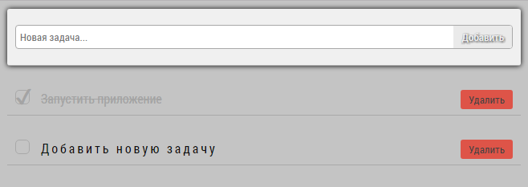

# JellyFish-ToDoList

Установка:
<ol>
<li>Склонировать репозиторий на свой компьютер <code>\>git clone https://github.com/EHoT-GH/JellyFish-ToDoList.git</code></li>
<li>Установить зависимости <code>\>npm install</code></li>
<li>Запустить приложение <code>\>npm start</code></li>
</ol
